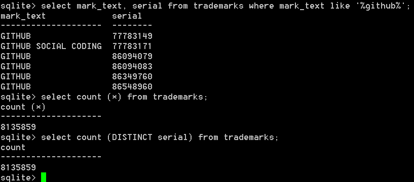

# trademark-sqlite
Parses USPTO trademark xml files into a sqlite database. Currently only tested with
a set of files that appear to contain 2015 and earlier data. 

## Getting the data

The data is at https://data.uspto.gov/data3/trademark/dailyxml/applications/
In the data/ directory, get_data_from_uspto.php does what the filename says. It uses wget. 
The 53 zip files add up to about 5GB. 

The script only downloads the initial set that were released on 12/31/2015, which I think 
(USPTO documentation is sparse) is all marks filed before that date. It does not download
the daily files after that. 

## Initialize the database

Use the create_tmdb.sql file to initialize a sqlite database. The database name by default
is ./tmdb.sqlite3
Unless your username is joe, and perhaps not even then, you will need to set the directory
where the database is in parse_trademarks.php where it says "change your path". 
So a sameple command would be
sqlite3 tmdb.sqlite3 < create_tmdb.sql

## Loading the database

Once you have the files, load the database. 

parse_trademarks.php parses a single file, parses out a few fields (mark name, filing date, 
serial and registration number) and inserts into the database. 

process_files.php runs a loop that calls the function in parse_trademarks.php that does
the heavy lifting

You can also download the database, 487MB, from https://morris.cloud/tmdb.sqlite3

## TO-DO items
(1) Additional verification to ensure all 2015-and-earlier trademarks are included in this data. 

(2) Add more fields, especially goods and services description and live/dead indicator.

(3) Parse daily xml files. Figure out how USPTO deals with updates to existing records.

If you are interested in contributing email me at joe at morris dot cloud. Eventually I 
hope to build an open-source trademark monitor (i.e., check periodically for similar marks
to one's own existing marks). 
